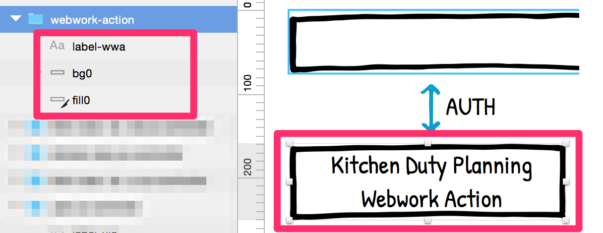

# Howto use SVG and SnapSVG together for Infographics

When loading the infografics we assume everything is grouped.
Groups should have ids to select by.

Inside groups it is assumed that there are certain paths that build the outline of a box.
These paths should have the id starting with `fill`.

Inside groups it is assumed that there are certain paths that build the background of a box.
These paths should have the class `bg`.

Inside groups it is assumed that there are labels. We assume these are provided as `text`.
The id should start with `label`
(Use a webfont that is included in the page and include svg via snapSVG to make webfonts work)

## Using Sketch

See how to do that in sketch here:

